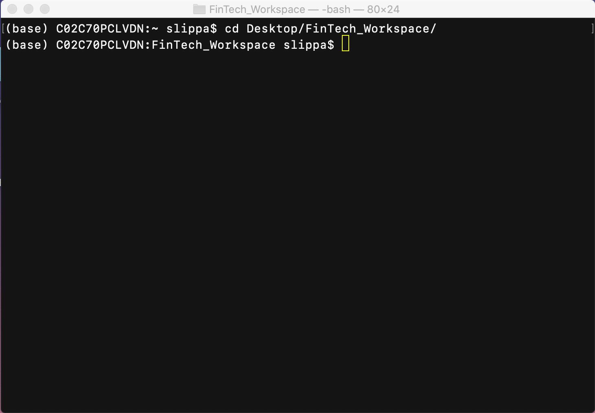
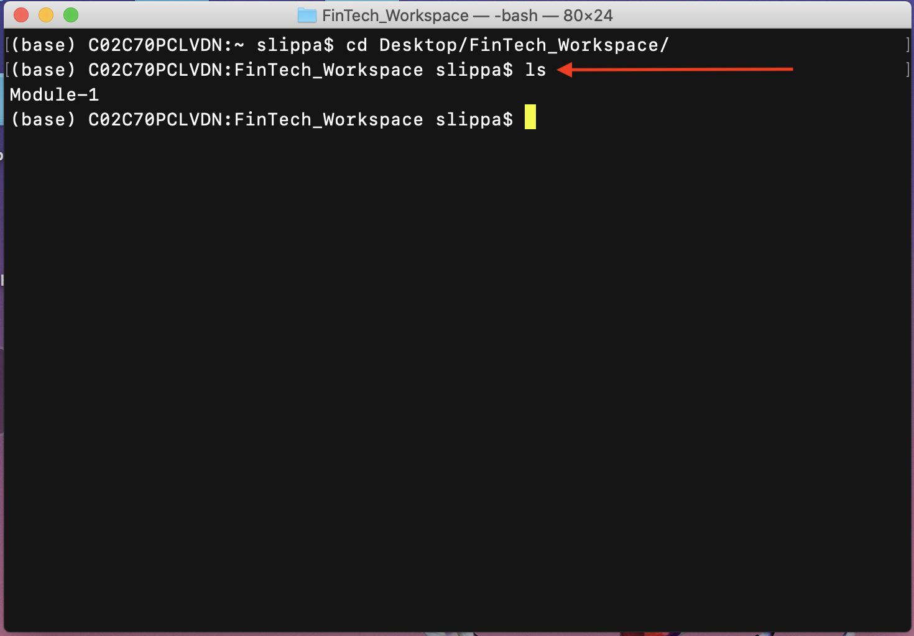
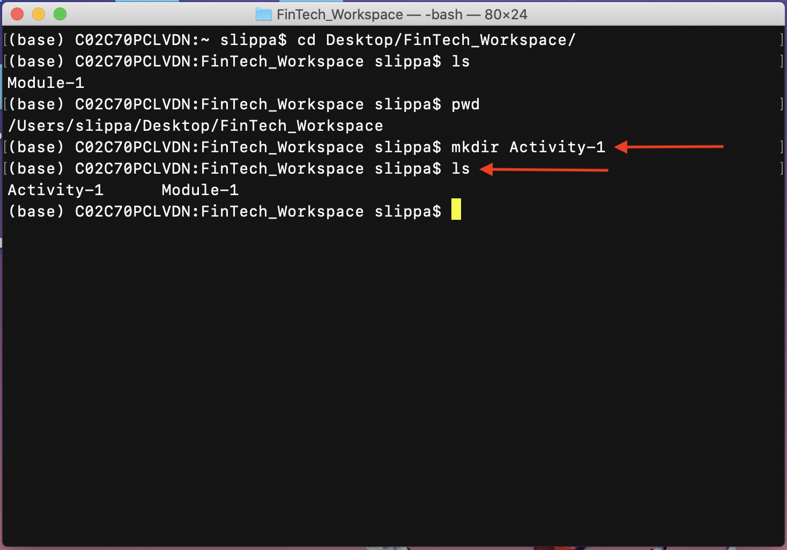
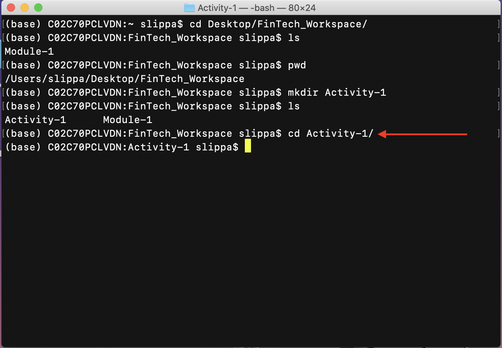
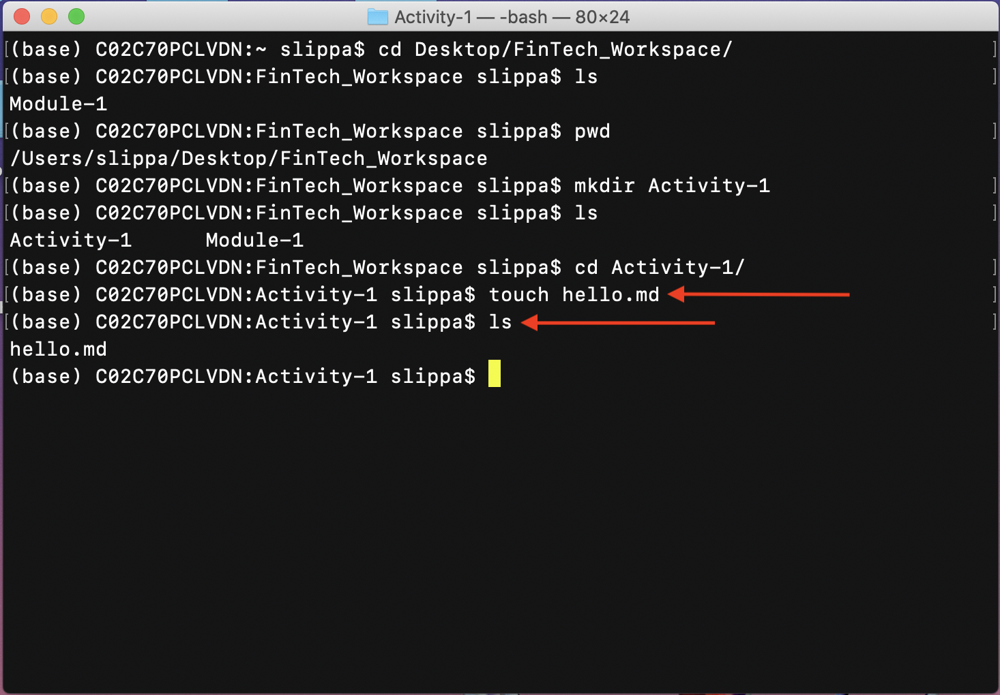
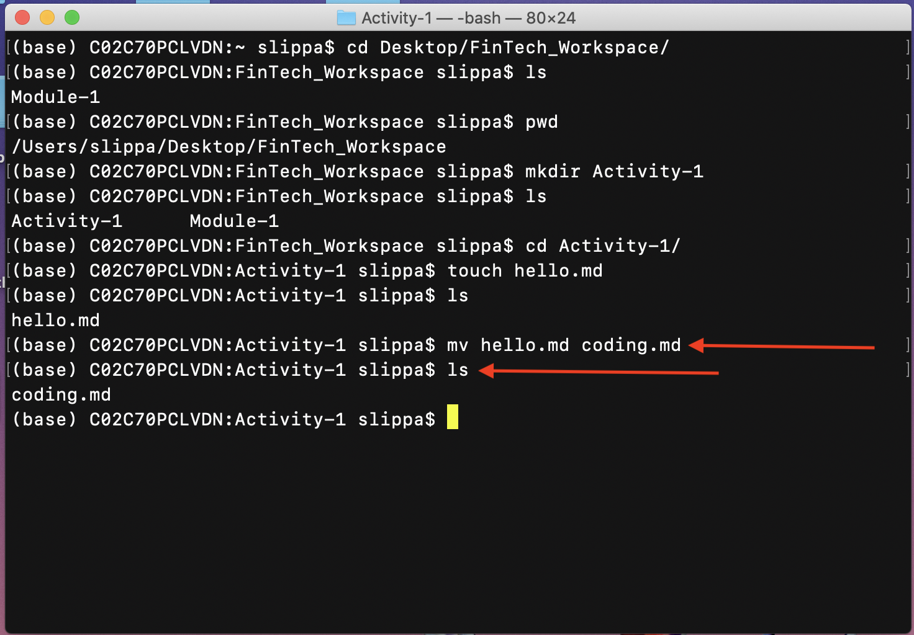
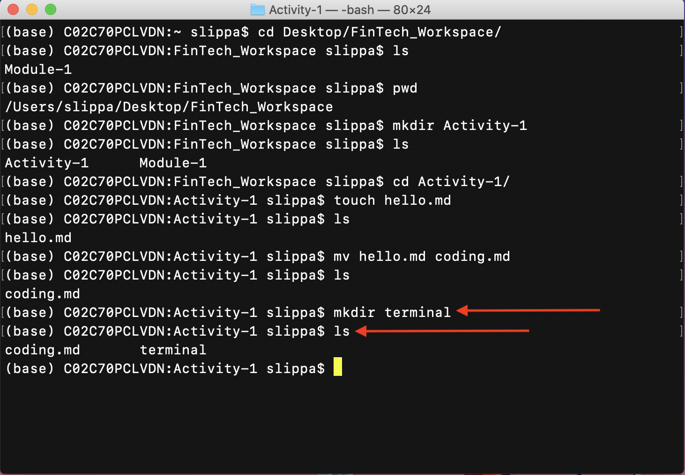
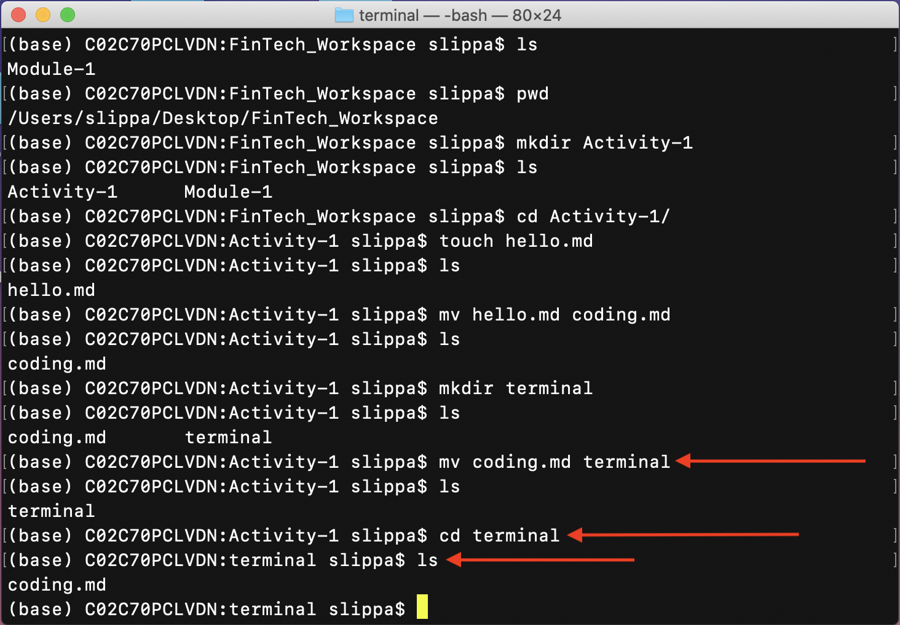
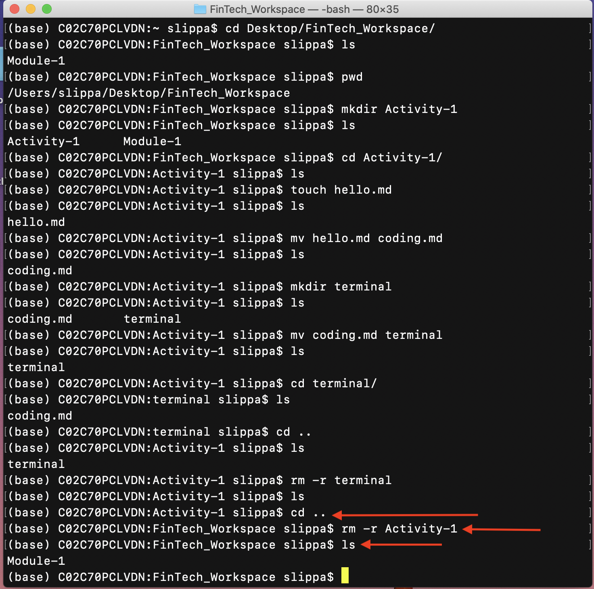

# Getting Familiar with the Terminal

In this activity, we'll practice a bit more with terminal commands.

## Solution

1. Navigate to your `FinTech_Workspace` folder, as shown in the following image:

    

2. Use the `ls` command to see the contents of that folder, as shown in the following image:

    

3. Use the `pwd` command to find the current path you're in, as shown in the following image:

    

4. In `FinTech_Workspace`, create a new directory named `Activity-1`. Then list the contents of the current directory again to make sure it worked. You should see something like the following image:

    

5. Navigate into the directory you just created. `Activity-1`, as shown in the following image:

    

6. Create a new file named `hello.md`. List the contents of the current directory again. You should see something like the following image:

    

7. Rename the `hello.md` file to `coding.md`, as shown in the following image:

    

8. Inside the `Activity-1` directory, create a new directory named `terminal`, as shown in the following image:

    

9. Move the `coding.md` file into the `terminal` folder you just made. Navigate into the terminal folder to confirm that the file has been moved. You should see something like the following image:

    

10. Delete the `terminal` folder. Note that you have to move up a directory to `Activity-1` before you can delete the terminal directory. You cannot delete a directory that you're currently in. You should see something like the following image:

    

11. Delete the `Activity-1` folder. Again, note that you have to move up a directory to `FinTech_Workspace` before you can delete the Activity-1 directory. You should see something like the following image:

    

## Hints

Use the terminal cheat sheet to determine which terminal commands should be used for each step.
