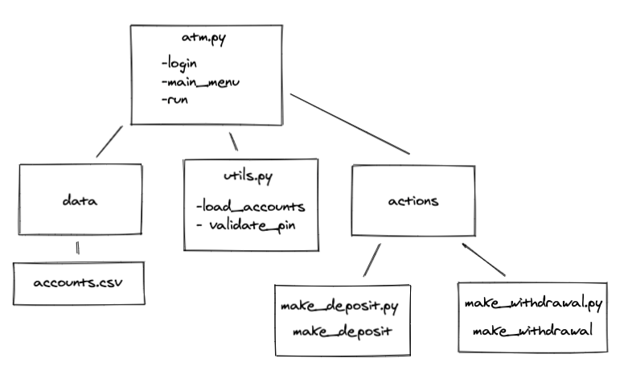

# ATM Modularization

In this activity, you will modularize the ATM application so that the codebase matches the following image:

## Files

Use the following files to complete this activity.

[atm.py](Unsolved/atm/atm.py)

[data/account.csv](Unsolved/atm/data/accounts.csv)

## Background

VS Code allows you to create both files and folders right in the application, so the file structure can be easily managed.

Copy and paste your functions from the main `atm.py` script into their new locations.

Be sure to include the appropriate import statements in `atm.py` to import the functions that were moved. You'll also need to add import statements for the various libraries into the relevant new script files. (You'll need to import `sys` into the new `make_deposit.py` script.)

## Instructions

Confirm that you're working inside the `atm` folder. Then complete the following steps:

1. If it hasn't been done previously, initiate the conda `atmdev` environment and activate it.

2. Inside the `atm` folder, create a new folder called `actions`. Then, in the `actions` folder, create two new Python script files: `make_deposit.py` and `make_withdrawal.py`.

3. Copy the `make_deposit(account)` function from inside `atm.py` over to the `make_deposit.py` script file. Once the function has been copied over, you can delete it from `atm.py`.

4. Inside the `make_deposit.py` script file, import the Python library `sys`.

5. In `atm.py`, add the import statement for the `make_deposit(account)` function.

6. Repeat the previous three steps for the `make_withdrawal(account)` function, to move it from `atm.py` into `make_withdrawal.py`.

7. Inside the `atm` folder, create a Python script file called `utils.py`.

8. Copy the `load_accounts()` and `validate_pin(pin)` functions from inside `atm.py` into the `utils.py` script file. Once they've been copied over, they can be deleted from `atm.py`.

9. Import the `csv`, `pathlib`/`Path`, and `sys` Python libraries into `utils.py`.

10. Confirm that your new ATM application structure matches the image. If so, run your application to confirm that it still works.

**Bonus:** If you haven't already attempted it, try writing the accounts, including the one that has been adjusted, back out to the CSV file.

---

© 2021 Trilogy Education Services, a 2U, Inc. brand. All Rights Reserved.
