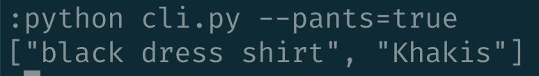

# Clothes Picker CLI

This is a command-line interface application for selecting an outfit composed of shirts and pants written in python.

---

## Technologies

This project leverages python 3.7 with the following packages:

* [fire](https://github.com/google/python-fire) - For the command line interface, help page, and entry-point.

* [questionary](https://github.com/tmbo/questionary) - For interactive user prompts and dialogs

---

## Installation Guide

Before running the application first install the following dependencies.

```python
  pip install fire
  pip install questionary
```

---

## Usage

To use the clothes picker application simply clone the repository and run the **cli.py** with the `--pants=true` flag for a full outfit:

```python
python cli.py --pants=true
```

Upon launching the clothes picker you will be greeted with the following prompts.



---

---

## Contributors

Brought to you by Shirt&Pants.ai.

---

## License

MIT
