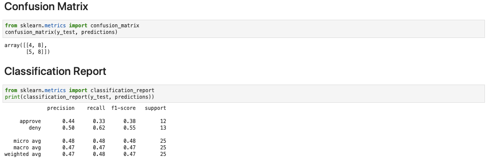

# SVM Loan Approver

In this activity, you will build a Support Vector Machine (SVM) classifier that can be used to predict the loan status (approve or deny) given a set of input features.

## Instructions

1. Read the data into a Pandas DataFrame.

2. Separate the features `X` from the target `y`. In this case, the loan status is the target.

3. Separate the data into training and testing subsets.

4. Scale the data using `StandardScaler`.

5. Import and instantiate an SVM classifier using sklearn.

6. Fit the model to the data.

7. Calculate the accuracy score using both the training and the testing data.

8. Make predictions using the testing data.

9. Generate the confusion matrix for the test data predictions.

10. Generate the classification report for the test data.

**Bonus**: Compare the performance of the SVM model against the logistic regression model. Decide which model performed better, and be prepared to discuss these results in an upcoming activity. Performance results for the logistic regression model can be found below.

  

---

© 2021 Trilogy Education Services, a 2U, Inc. brand. All Rights Reserved.
