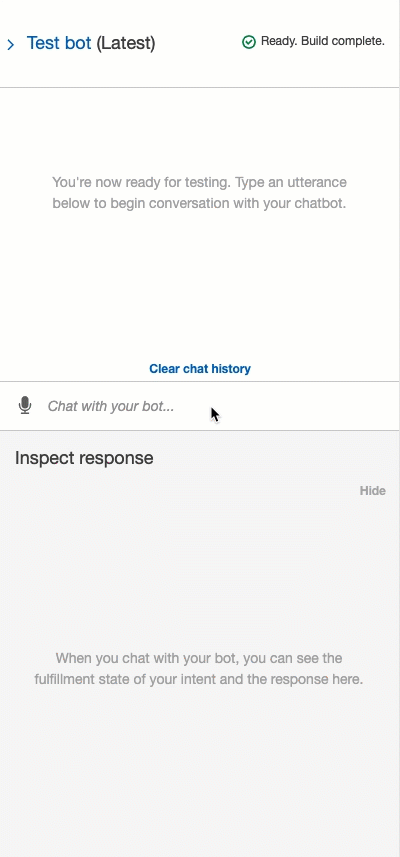

# Bitcoin Fear & Greed Advisor

Nowadays, bitcoin is gaining the attention of people that have never bought or invested in it. However, most people are skeptical or afraid of loosing their money.

The Bitcoin Fear & Greed Index offers a mechanism to assess how the market feels about this cryptocurrency, though it isn't professional investment advice, it can give some insights about the convenience of investing or buying bitcoin.

In this activity, you will work on creating a chatbot that will advise users whether or not to invest in bitcoin according to the "Fear & Greed Index" provided by [the Alternative.me crypto API](https://alternative.me/crypto/fear-and-greed-index/).

This index takes information from various sources such as social media, surveys, Google Trends data, coin volatility, the dominance of a coin, and volume.

In this index, a value of 0 means "Extreme Fear" while a value of 100 represents "Extreme Greed".

## Instructions

### Create the Bitcoin Advisor Bot

1. Log-in to the AWS Management Console using your Administrator IAM user, navigate to the Amazon Lex console and create a new custom bot with the following parameters:

    * Bot name: BitcoinAdvisor

    * Language: English (US)

    * Output voice: Matthew

    * Session timeout: 5 min

    * Sentiment analysis: No

    * IAM role: Leave default value

    * COPPA: No

    * Advanced options: No

### Create the getFGIndex Intent

1. Add a new intent and name it `getFGIndex`.

2. Define some sample utterances, start by adding the following:

    * I want to invest in bitcoin

    * I want to buy bitcoin

    * How is the bitcoin market feeling today

### Add Slots

1. Continue by adding the following slot.

    * Name: amount

    * Slot type: AMAZON.NUMBER

    * Prompt: How many dollars do you want to buy?

> **Important:** Make sure to check the "Required" option of the slot.

#### Set the Confirmation Prompt Section

1. On the "Confirmation prompt" section, add the following confirm and cancel prompts.

    * Confirmation prompt: Are you sure you want to buy ${amount} dollars in bitcoin?

    * Cancel prompt: Okay, let's start again.

#### Test the Bot

1. Build the bot by clicking on the "Build" button.

2. Once the build process ends, test your bot with the sample utterances, you should have a final conversation flow like the following.

---
© 2021 Trilogy Education Services, a 2U, Inc. brand. All Rights Reserved.
