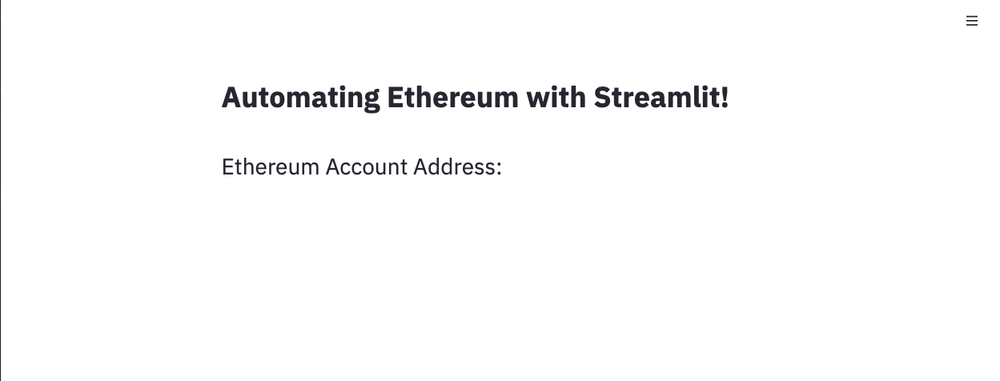
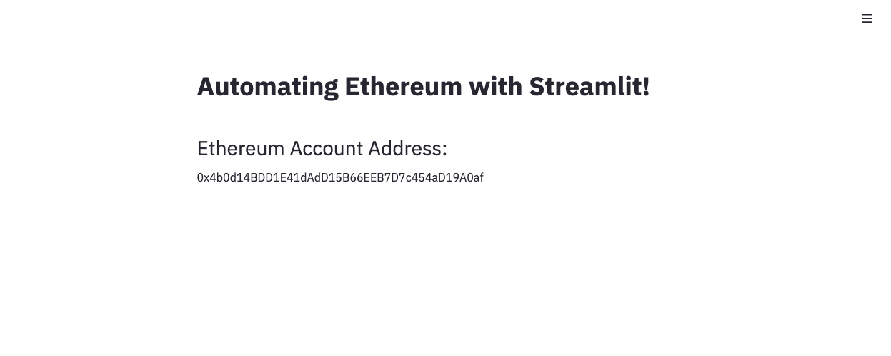
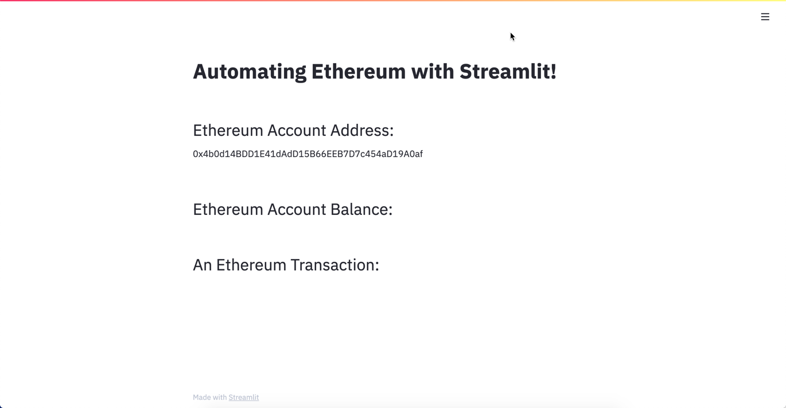
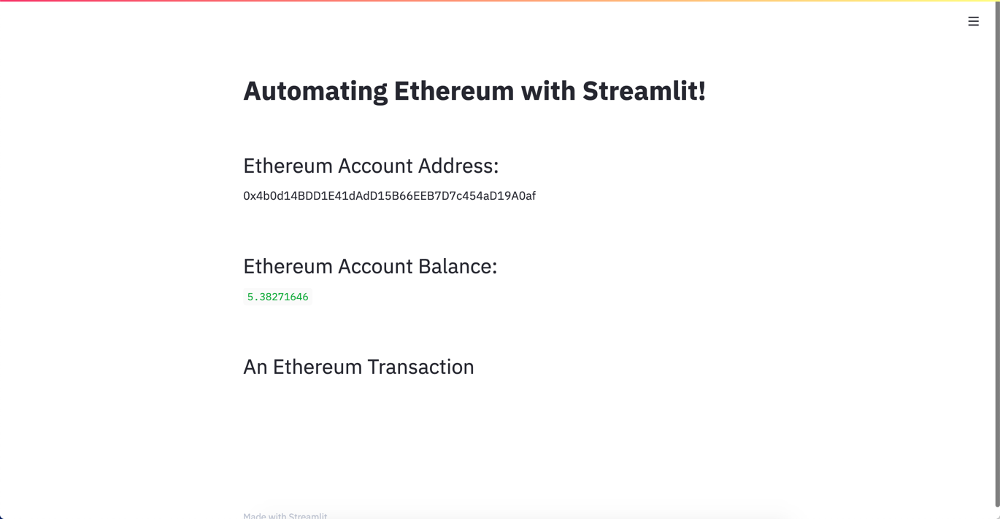
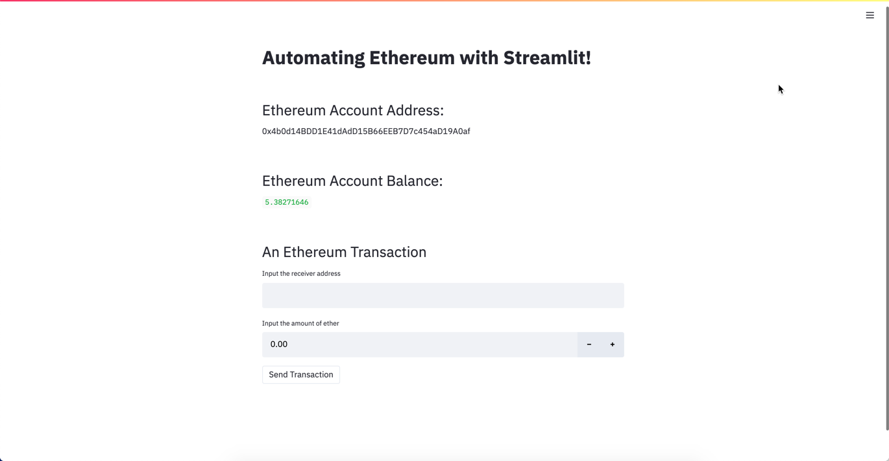
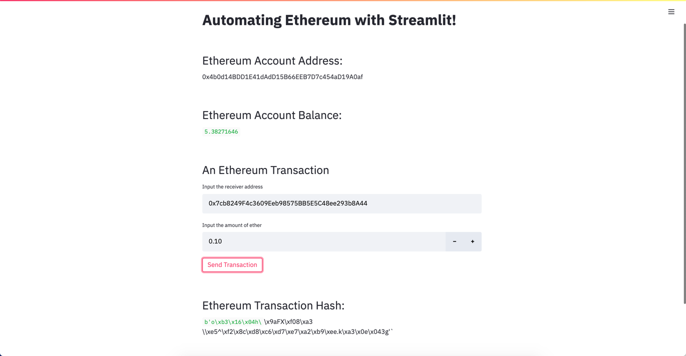

# Module 19: Virtual Class II Lesson Plan (2 hours)

## Overview

In this lesson, students will learn to sign and send transactions to the Ethereum blockchain.

The first part of the class will involve activities that confirm students have connected Web3 to Ganache and created dummy Ethereum accounts. Both of these tasks are necessary for them to complete both this lesson and the Challenge assignment.

In the middle section of class, everyone will create and send a signed transaction.

The last part of the class will focus on automating blockchain functionality to work in a Streamlit application. This is the basis of the Challenge assignment.

## Learning Objectives

By the end of the session, learners will be able to do the following:

* Explain how developers can use Ganache to test transactions.

* Review both account and transaction details in Ganache.

* Integrate the Streamlit web application with Web3.py to automate interactions with blockchain.

---

## Time Tracker

| Start   | #  | Activity                                         | Time |
| ------- | -- | ------------------------------------------------ | ---- |
| 7:00 PM | 1  | Instructor Do: Welcome Class| 0:05 |
| 7:15 PM | 2  | Everyone Do: Ethereum and Streamlit             | 0:15 |
| 7:35 PM | 3 |  Student Do: Automating Ethereum                                                 | 0:35 |
| 8:10 PM | 4  | Instructor Do: Review Automating Ethereum              | 0:15 |
| 8:20 PM | 5  | Student Do: Cats Mini Project                            | 0:40 |
| 8:50 PM | 6  |  Instructor Do: Review Cats Mini Project       | 0:10 |
| 9:00 PM |    | END                                              |      |

---

## Instructor Do: Office Hours (30 min)

Welcome to Office Hours! Remind the students that this is their time to ask questions and get assistance from their instructional staff as they’re learning new concepts and working on the challenge assignment. Feel free to use breakout rooms to create spaces focused on specific topics, or to have 1:1s with students.

Students may request assistance with the following:

* Challenge assignment
* Further review of a particular subject
* Debugging assistance
* Computer issues
* Guidance with a particular tool

Inform students that today's class will involve working with Ganache. They should download Ganache now if they have not already done so.

---

## Class Activities


### 1. Instructor Do: Welcome Class (5 min)

In this portion of the lesson the instructor will confirm that the class has an understanding of wallets through a quick Q/A.

**Question:** What is the difference between a hot and a cold wallet?
**Answer:** A hot wallet is connected to the internet (i.e. coin base, metamask)and a cold wallet is only connected when attached to your computer.


**Answer:** A hot wallet is less secure than a cold wallet.

**Question:** Explain public and private keys.
**Answer:** The public key is used to encrypt the plain text to convert it into cipher text. A private key is used by the receiver to decrypt the cipher text to read messages or send ether.
**Answer:** The public key is known to the blockchain, while the private key is only known to the account owner.
**Answer:** The private key is needed to send ether to other accounts. The public key is known to other members of the blockchain community. It can be used by them to send transactions to that user.

Navigate to the [Ganache Download page](https://www.trufflesuite.com/ganache).

Confirm that everyone in the class has Ganache downloaded. Ask the TAs to support anyone who is having installation issues.

---

### 2. Everyone Do: Ethereum and Streamlit (15 min)

In this activity, you will lead students through the process of integrating the account functionality of Ethereum's blockchain with the Streamlit web application.

**Instructor Note:** Because this activity involves Streamlit, we will use Python files rather than Jupyter notebooks for the application. The students have been instructed to use Visual Studio Code for these programs.

**Corresponding Activity** [Ethereum and Streamlit](./Activities/01-Evr_Ethereum_and_Streamlit)

**Files:**

[Sample.env](./Activities/01-Evr_Ethereum_and_Streamlit/Unsolved/SAMPLE.env)

[app.py](./Activities/01-Evr_Ethereum_and_Streamlit/Unsolved/app.py)

[Ethereum.py](./Activities/01-Evr_Ethereum_and_Streamlit/Unsolved/ethereum.py)

[Solution folder](./Activities/01-Evr_Ethereum_and_Streamlit/Solved)


Zip the following folder and slack it out to the students so that they can code along:

[Starter code](./Activities/01-Evr_Ethereum_and_Streamlit/Unsolved/)

Explain to the students that the focus of this activity is twofold:

 1. To automate the Ethereum account functionality that we have learned up to now with the use of Python functions.

 2. To integrate those Python functions with a Streamlit web application.

Because Streamlit is involved, the activity will involve Python files rather than Jupyter notebooks. Visual Studio Code will be the IDE used for this and the following activities.

Once the students have the starter folder open in VS Code, have them update the `SAMPLE.env` file with their mnemonic seed phrase.

Next, open the Python file named `ethereum.py`.

 * Note the imports that are included in the `ethereum.py` file. These should be familiar to the students, as they are the imports associated with loading the variables from the `.env` file.

Explain that, in this `ethereum.py` file, you will create a Python function that does five things:

1. Accesses the `MNEMONIC` variable from the `.env` file
2. Uses the `mnemonic` variable to create a HD `wallet`
3. Uses the `wallet` to generate a public/private key pair
4. Uses the `private` key to create an Ethereum `account`
5. Returns the `account` from the function

Write the code that defines the function:

 ```python
 # Create a function called `generate_account` that automates the Ethereum
 # account creation process
 def generate_account(w3):
 ```

Ask for a volunteer to provide you with the five lines of code that define the body of the function.

 ```python
 # Access the mnemonic phrase from the `.env` file
 mnemonic = os.getenv("MNEMONIC")

 # Create Wallet object instance
 wallet = Wallet(mnemonic)

 # Derive Ethereum private key
 private, public = wallet.derive_account("eth")

 # Convert private key into an Ethereum account
 account = Account.privateKeyToAccount(private)

 # Return the account from the function
 return account
 ```

When complete, the entire function should appear as follows:

 ```python
 # Create a function called `generate_account` that automates the Ethereum
 # account creation process
 def generate_account(w3):

     # Access the mnemonic phrase from the `.env` file
     mnemonic = os.getenv("MNEMONIC")

     # Create Wallet object instance
     wallet = Wallet(mnemonic)

     # Derive Ethereum private key
     private, public = wallet.derive_account("eth")

     # Convert private key into an Ethereum account
     account = Account.privateKeyToAccount(private)

     # Return the account from the function
     return account
 ```

* By creating the `generate_account` function, we have **automated** the process of creating an Ethereum account from a mnemonic seed phrase.

* With the function created, it’s time to turn our attention to using the power of the automation process in conjunction with the Streamlit web application.

Open the `app.py` Python file, and review the single import for the Streamlit library.

The next step is to import the `generate_account` function from `ethereum.py`.

Pose the following question:

**Question:** What is the syntax for importing the `generate_account` function from the `ethereum.py` file into the `app.py` file?

* **Answer:**

 ```python
 from ethereum import generate_account
 ```

 * The functionality associated with the `generate_account` function is now available on the `app.py` page.

Next, we want to create an `account` variable in Streamlit that contains the information generated in the `generate_account` function.

**Question:** Does anyone know the code for creating an `account` variable on the Streamlit page that will hold the information generated by the `generate_account` function that has just been imported?

* **Answer:**

 ```python
 # Generate the Ethereum account
 account = generate_account(w3)
 ```

 * This code will call the `generate_account` function, create the wallet and account, and return the information to the Streamlit page to be accessed via the `account` variable.

Once the account information has been returned to the Streamlit page, we can display it on the web application.

Briefly review the Streamlit code that will display the initial markdown text on the page:

```python# Streamlit application headings
st.markdown("# Automating Ethereum with Streamlit!")
st.text("\n")
st.markdown("## Ethereum Account Address:")
```

Run the Streamlit application before adding the address information.

 * Navigate to the folder in your terminal and type `streamlit run app.py`.

 * The following Streamlit page should open in your browser:

 

Pose the following question:

**Question:** What is the code to write the account address to the Streamlit application page?

* **Answer:**

 ```python
 # Write the Ethereum account address to the Streamlit page
 st.write(account.address)
 ```

Navigate back to your browser and refresh the application.

 

It’s that easy to automate an Ethereum transaction and get the results to display on the Streamlit application webpage!

Ask the students if they have any questions about this activity before proceeding to a similar activity that the students will complete independently.

### 3. Student Do: Automating Ethereum (35 min)

In this activity, students will add functions that automate the process of accessing the balance from the Ganache blockchain as well as sending a signed transaction. They will then incorporate these functions into the Streamlit web application.

**Corresponding Activity** [Automating Ethereum](./Activities/02-Stu_Automating_Ethereum)

**Files:**

[Instruction](./Activities/02-Stu_Automating_Ethereum/README.md)

[SAMPLE.env](./Activities/02-Stu_Automating_Ethereum/Unsolved/SAMPLE.env)

[app.py](./Activities/02-Stu_Automating_Ethereum/Unsolved/app.py)

[ethereum.py](./Activities/02-Stu_Automating_Ethereum/Unsolved/ethereum.py)

Zip the following folder and slack it out to the students:

[Starter folder](./Activities/02-Stu_Automating_Ethereum/Unsolved/)

Break the students up into groups of two or three to complete this activity.

If, at the 10-15 minute mark, it appears that the students are struggling with the `get_balance` functionality, feel free to bring the group back and review the solution. Then give them a chance to construct the `send_transaction` function.

#### Instructions

This activity is divided into two main sections:

 1. Create the `get_balance` function and add it to the Streamlit application.

 2. Create the `send_transaction` function and add it to the Streamlit application.

Complete the following steps:

Add your mnemonic seed phrase to the `SAMPLE.env` file included in the activity's `Unsolved` folder. Once the variables have been added, resave this as a `.env` file.

Section 1: Create the `get_balance` function and add it to the Streamlit application.

 1. Open the `ethereum.py` file.

 2. Create a Python function called `get_balance`. The function will take one argument called `address`.

 3. Call the `w3.eth.get_balance` function and pass it the `address` argument. Set this function call equal to a variable called `wei_balance`.

 4. Call the `w3.fromWei` function and pass it `wei_balance` as an argument. Specify that you want to convert the wei balance to ether. Set this call equal to a variable called `ether`.

 5. Return the `ether` balance from the function.

 6. Open the `app.py` file.

 7. Import the `get_balance` function from the `ethereum.py` file.

 8. In the `Display Ethereum Account Balance` section, call the `get_balance` function and pass it the `account.address`. Set this function call equal to a variable called `ether_balance`.

 9. Write the `ether_balance` to the Streamlit page.

 10. Save your files. Navigate to the Unsolved folder inside a terminal instance. Run the application by typing `streamlit run app.py`.  Both your account address and ether balance should display to the Streamlit page.

Section 2: Create the `send_transaction` function and add it to the Streamlit application.

 1. Return to the `ethereum.py` file.

 2. Create a Python function called `send_transaction`. The function will take three arguments called `account`, `receiver`, and `ether`.

 3. Inside the function, set a medium gas price strategy by calling the function `w3.eth.setGasPriceStrategy(medium_gas_price_strategy)`.

 4. Call the `w3.teWei` function and pass it the argument `ether`. You will also need to specify that "ether" is the denomination of the value being converted. Finally, set this function call equal to the variable `wei_value`.

 5. Estimate the gas it will take to mine the transaction. Call the function `w3.eth.estimateGas` and pass it 3 arguments as key:value pairs:

 ```python
 { "to": receiver, "from": account.address, "value" : wei_value}
 ```

 This function should be set equal to the variable `gas_estimate`.

 6. Construct the transaction object. Set the transaction object equal to the variable `raw_tx`. The keys you will need to complete are: "to", "from", "value", "gas", "gasPrice" (the corresponding value is `w3.eth.generateGasPrice`) and the "nonce" (the corresponding value is `w3.eth.getTransactionCount(account.address)).

 7. Call the `account.signTransaction` function and pass it the `raw_tx` as an argument. Set this equal to a variable called `signed_tx`.

 8. Return the `w3.eth.sendRawTransaction` function. You will need to pass `signed_tx.rawTransaction` as the function argument.

 9. Navigate back to the `app.py` file.

 10. Import the `send_transaction` function from the `ethereum.py` file.

 11. In the `An Ethereum Transaction` section, create two user input fields:

     * A text input field that will take in the receiver's Ethereum address. Set this equal to a variable called `receiver`.

     * A number input field that will take in the amount of ether to be sent in the transaction. Set this equal to a variable called `ether`.

 12. Create a Streamlit button that reads "Send Transaction".

 13. Inside the button, call the `send_transaction` function and pass three arguments: `account`, `receiver` and `ether. Set this function call equal to a variable called `transaction_hash`

 14. Create an Streamlit markdown line that reads "## Ethereum Transaction Hash:".

 15. Write the `transaction_hash` to the page.

 16. Save your files. Navigate to the Unsolved folder inside a terminal instance. Run the application by typing `streamlit run app.py`.  Both your account address and ether balance should display to the Streamlit page. Now add values to the `receiver` and `ether` input fields and click the "Send Transaction` button.  After a bit, a transaction hash should be displayed to the screen.


 17. Pat yourselves on the back! This was a challenging activity to complete. You did a fabulous job putting all of the pieces together.


### 4. Instructor Do: Review Automating Ethereum (15 min)

The focus of this review should be on automating the Ethereum processes by creating functions. Try to elicit as much student engagement as possible to ensure their understanding of the activity.

**Instructor Note** You will need to add your mnemonic seed phrase to a `.env` file before starting this activity.

**Corresponding Activity** [Automating Ethereum](./Activities/02-Stu_Automating_Ethereum)

**Files:**

[Starter folder](./Activities/02-Stu_Automating_Ethereum/Unsolved/)

[Instruction](./Activities/02-Stu_Automating_Ethereum/README.md)

[SAMPLE.env](./Activities/02-Stu_Automating_Ethereum/Solved/SAMPLE.env)

[app.py solved file](./Activities/02-Stu_Automating_Ethereum/Solved/app.py)

[ethereum.py solved file](./Activities/02-Stu_Automating_Ethereum/Solved/ethereum.py)


Start the review by running the Streamlit application from the `Unsolved` file.

 * Navigate to the `Unsolved` folder location in the terminal and type `streamlit run app.py`.

If the appropriate information has been added to the `.env` file, the screen should look similar to the following:



Confirm that the goal of this activity is to enhance the application by adding the functionality that checks a user's balance and allows them to send an ether transaction.

#### Code the `get-balance` function

The next step in the review is to code the `get_balance` function in the `ethereum.py` file.

Ask the students the following question:

**Question:** At a high level, what are the three steps required to code the `get_balance` function?

 **Answer:** 1) Using the account address, call the w3 `get_balance` function to get the balance of the account in wei from Ganache. 2) Convert the wei to ether 3) Return the ether from the funcion.

Code the following function out with the students:

 * Highlight that the function will take in one argument `address` from the Streamlit page. This is the account address that will be used to make the call to the Ganache blockchain.

 ```python
 # Create a function called `get_balance` that calls the Ganache blockchain, converts the wei balance of the account to ether, and returns the value of ether

 def get_balance(w3, address):
    """Using an Ethereum account address access the balance of Ether"""
    # Get balance of address in Wei
    wei_balance = w3.eth.get_balance(address)

    # Convert Wei value to ether
    ether = w3.fromWei(wei_balance, "ether")

    # Return the value in ether
    return ether
 ```

Now navigate to the `app.py` file and as the following question:

**Question:** What needs to be done to make the `get_balance` function available in the `app.py` file?

* **Answer:** The import statement needs to be adjusted.

 ```python
 # Import the functions from ethereum.py
 from ethereum import w3, generate_account, get_balance
 ```

Next, navigate to the `Ethereum Account Balance` section and create the code that calls the `get_balance` function, passing in `w3` and `account.address` as arguments.

 * Highlight that `account.address` is available from the original call to the `generate_account` function.

 ```python
 # Call the get_balance function and write the account balance to the screen
 ether_balance = get_balance(w3, account.address)
 st.write(ether_balance)
 ```

After having saved your files, you should be able to navigate to the Streamlit web application in your browser and refresh the screen. After a few moments, the balance of KETH in your account should appear on the screen.



Ask students if they have any questions about either the `get_balance` function or how it is being called from the Streamlit webpage.

#### Code the `send_transaction` function

Return to the `ethereum.py` file and work through the process of coding the `send_transaction` function.

 * This function is a bit more complicated than either the `generate_account` or `get_balance` functions.

Start by creating the function and highlighting the necessary arguments - the `account`, the `receiver` address and the amount of `ether` that is being sent.

 ```python
 # Create a function called `send_transaction` that creates a raw transaction, signs it, and sends it
 # Return the confirmation hash from the transaction
 def send_transaction(w3, account, receiver, ether):
 ```

* Unlike the `get_balance` function where just the `account.address` was sent as an argument, the entire `account` is being sent as an argument. Ask the following question:

**Question:** Can anyone explain why we are sending the entire `account` as an argument rather than just the `account.address`?

* **Answer:** The account's private key will be required to sign the transaction we are creating. As a result, we will need the entire account object sent to the function.

Next, discuss at a high level the six steps that we are going to code inside the `send_transaction` function.

 1. Set the gas price strategy - again, using a medium gas price strategy.
 2. Convert the amount of ether to wei.
 3. Calculate the gas estimate - for that, you need the receiver address, the sender's address, and the wei value.
 4. Construct the raw transaction - receiver, sender, wei value, gas estimate, gas price, and nonce.
 5. Create the signed transaction.


With those steps in mind, begin to work through the code with the students.

 ```python
 # Create a function called `send_transaction` that creates a raw transaction, signs it, and sends it
 def send_transaction(w3, account, receiver, ether):
     """Send an authorized transaction to the Ganache blockchain."""
     # Set a medium gas price strategy
     w3.eth.setGasPriceStrategy(medium_gas_price_strategy)

     # Convert eth amount to Wei
     wei_value = w3.toWei(ether, "ether")

     # Calculate gas estimate
     gas_estimate = w3.eth.estimateGas({"to": receiver, "from": account.address, "value": wei_value})

     # Construct a raw transaction
     raw_tx = {
         "to": receiver,
         "from": account.address,
         "value": wei_value,
         "gas": gas_estimate,
         "gasPrice": w3.eth.generateGasPrice(),
         "nonce": w3.eth.getTransactionCount(account.address)
     }

     # Sign the raw transaction with ethereum account
     signed_tx = account.signTransaction(raw_tx)

     # Send the signed transactions
     return w3.eth.sendRawTransaction(signed_tx.rawTransaction)
 ```

With this code in place, navigate back to the `app.py` page and ask the following question:

**Question:** What is the first think we should do on the `app.py` page?

* **Answer:** Update the import statement to include the `send_transaction` function.

 ```python
 # Import the functions from ethereum.py
 from ethereum import w3, generate_account, get_balance, send_transaction
 ```

Navigate down to the `An Ethereum Transaction` section.

The first step is to code the two required input fields - the receiver address and the amount of ether.

 * Highlight that both of these variables will be used as arguments when the `send_transaction` function is eventually called.

 ```python
 # Create inputs for the receiver address and ether amount
 receiver = st.text_input("Input the receiver address")
 ether = st.number_input("Input the amount of ether")
 ```

Next, create a button that will initiate the call to the `send_transaction` function and display the transaction hash once it is returned from the function.

```python
# Create a button that calls the `send_transaction` function and returns the transaction hash
if st.button("Send Transaction"):

   transaction_hash = send_transaction(w3, account, receiver, ether)

   # Display the Etheremum Transaction Hash
   st.text("\n")
   st.text("\n")
   st.markdown("## Ethereum Transaction Hash:")

   st.write(transaction_hash)
```

After again saving your files, navigate to the Streamlit application in your browser and refresh the page. It should now appear as follows:



Input a receiver address and an amount of ether and click the "Send Transaction" button. After a few moments, the screen should appear as follows:




Ask the students if they have any questions about the process of automating the Ethereum transaction functions and making them available to use in a live web application.

Stress that these are advanced concepts that show just how far they have come with both the knowledge of coding and of blockchain.

They can now make live calls to the Ethereum blockchain!

Finally, remind students that office hours will begin next if anyone needs additional support.

---
### 5. Student Do: Cats Mini Project

In this activity, students will create a Streamlit web application similar to the homework.

**Corresponding Activity** [Cats Mini Project](Activities/03-Stu_Cats_Mini_Project)

**Files:**

[Sample.env](./Activities/03-Stu_Cats_Mini_Project/Unsolved/SAMPLE.env)

[cat_shop.py](./Activities/03-Stu_Cats_Mini_Project/Unsolved/cat_shop.py)

[crypto_wallet.py](./Activities/03-Stu_Cats_Mini_Project/Unsolved/crypto_wallet.py)

[Solution folder](./Activities/03-Stu_Cats_Mini_Project/Solved)


Zip the following folder and Slack it out to the students so that they can code along:

[Starter code folder](./Activities/03-Stu_Cats_Mini_Project/Unsolved/)

## Instructions

Complete each of the following steps:

1. In the `Unsolved` folder, create your `.env` file, which will save your mnemonic seed phrase in the variable `MNEMONIC`.

2. Navigate to your Ganache application and copy the mnemonic seed phrase into the `.env` file.

3. Inside the `generate_account` function in `crypto_wallet.py`, use the mnemonic seed phrase you created in the previous lesson, and the `Wallet()` class from the bip44 package, to generate a wallet instance. Then, derive your private and public keys by calling the `.derive_account` method on the `wallet` object and passing it the string “eth”. Save the two returned values as variables named `private` and `public`.

4. Pass the private-key value to `Account.privateKeyToAccount`, and save the returned `account` object as a variable named `account`.

5. Then, build a `get_balance` function that will fetch the balance of your Ethereum address by using Web3.py. To do so, complete the following steps:

* Create a function named `get_balance` that accepts two arguments, `w3` and `address`.

* Call the `w3.eth.getBalance` method, and pass it the `address` variable. Save the returned value as a variable named `wei_balance`.

* Call the function `w3.fromWei`, and pass it your `wei_balance` variable and the string “ether”. Save the returned value as a variable named `ether`.

* Return the account balance in ether.

6. Navigate to the `cat_shop.py` file.

7. Import the following from the `crypto_wallet.py` file:

* `w3`

* `generate_account`

* `get_balance`

8. Review the provided code, as you will be adding to it to build your application.

9. Inside the `get_cats` function in the for loop use `st.write` to add the objects from the object above into the code which provides the cats’ information such as the price and name.

10. Then, create Streamlit application headings using `st.markdown` to explain this app is for buying cats.

11. Call the `generate_account` function and save it as a variable  called `account`.

12. Call the `get_balance` function and save it as a variable `ether`.

13. Create a select box to choose a Cat using `st.sidebar.selectbox`

14. Create a header using ` st.sidebar.markdown()` to display cat name and price.

15. Then, create a variable called `cat_price` to retrieve the cat price from the `cat_database` using block notation.

16. Finally, use a conditional statement using the `if` keyword to check if the selected cat can be purchased. This will be done by checking the user's account balance that wishes to make the purchase by checking if the `ether` variable we created is greater than or equal to the `cat_price`.


---
### 6. Instructor Do: Review Cats Mini Project

**Corresponding Activity**[Adding an Interface with Streamlit](Activities/03-Stu_Cats_Mini_Project)

Ask the class how they did and if they have any questions in regards to the mini project. Open the `Unsolved` folder for activity five `Cats Mini Project` and begin coding in VSCode.

**Files:**
[Adding an Interface with Streamlit](./Activities/03-Stu_Cats_Mini_Project/Solved)

**Links:**
[Sreamlit Documentation](https://docs.streamlit.io/en/stable/)
[Web3.py Documentation](https://web3py.readthedocs.io/en/stable/)

First, open the `crypto_wallet.py`. Begin explaining to students the first function is to generate their wallets as they have done before in this lesson. This time they are wrapping it in a function so it can be accessed in the other file.

 ```python
 def generate_account(w3):
   """Create a digital wallet and Ethereum account from a mnemonic seed phrase."""
     # Fetch mnemonic from environment variable.
     mnemonic = os.getenv("MNEMONIC")

     # Create Wallet Object
     wallet = Wallet(mnemonic)

     # Derive Ethereum Private Key
     private, public = wallet.derive_account("eth")

     # Convert private key into an Ethereum account
     account = Account.privateKeyToAccount(private)


     return account
 ```

Next, create a `get_balance` function to obtain the balance from our wallet.

* Remind the class that this is similar to what they have done throughout the duration of this unit.

 ```python
 def get_balance(w3, address):
    """Using an Ethereum account address access the balance of Ether"""
    # Get balance of address in Wei
    wei_balance = w3.eth.get_balance(address)

    # Convert Wei value to ether
    ether = w3.fromWei(wei_balance, "ether")

    # Return the value in ether
    return ether
```

After this function is written navigate to the `cat_shop.py` file.

* Briefly explain that the starter code imports `dataclass`, which is a tool to make structured classes for storing data. These classes hold certain properties and functions to deal specifically with data and its representation.

Then import the functions from the other file.

* Review the objects and explain that these serve as the database and the name list for retrieving the possible cats that can be purchased.

 ```python
 cat_database = {
    "Jennifurr": ["Jennifurr", 22],
    "Cheddar": ["Cheddar", 151],
    "Meowise": ["Meowise", 31],
 }

 # Create a list of the the cats by first names
 kitties = ["Jennifurr", "Cheddar", "Meowise"]
 ```

* Then begin to explain the for loop in the `get_cats` function. This for loop uses `db_list` to return each part of the object above and displays it using block notation.

 ```python
 for number in range(len(kitties)):
        st.write("Name: ", db_list[number][0])
        st.write("Price in Ether: ", db_list[number][1], "eth")
        st.text(" \n")
 ```

* Next explain that `st.write` uses Streamlit to add the objects to the user interface. The `st.text` can be used to format this and add an empty line below.

The next step is to create headers using `st.markdown`

 ```python
 st.markdown("# Kitties")
 st.markdown("## Buy a Kitty!")
 st.text(" \n")
 ```

Then we will call our functions from the previous file and save them as variables.

 ```python
 account = generate_account(w3)

 ether = get_balance(w3, account.address)
 ```

Then we use `st.sidebar.selectbox` to create a select box to chose a cat. We pass in the names of the cats as `kitties` the list from the starter code.

 ```python
 cat = st.sidebar.selectbox('Select a cat', kitties)
 ```

Then, still using `streamlit` we create a header to display cat name and price.

 ```python
 st.sidebar.markdown("## Cat Name and Price")
 ```

We then create a new variable to identify the cat for purchase by name referencing the object.

 ```python
 cat = cat_database[cat][0]
 ```

Create a variable called cat_price to retrieve the cat price.

 ```python
 cat_price = cat_database[cat][1]
 ```

* Explain to the class that we are comparing the cat price to the amount of ether they have in their account balance.

 ```python
 if cat_price <= ether:
```

Ask the class if they have any questions about Streamlit, using it with wallets, or finding the account balance with Web3.py.
Before ending the class, summarize the key takeaways from today’s lesson in the next few talking points.
The application students just built is similar to the homework in the sense that it uses Ganache and Streamlit to build an ethereum based application.

Tell the class to pay special attention to the functions they wrote.
Congratulate the class on learning how to use Ganache as a mock blockchain in conjunction with Steamlit and Web3.py.

## Open Office Hours

### Q&A and System Support

This is an opportunity to support students in any way that they require.

* Offer personalized support for students. (**Note:** Feel free to pair individual students off with instructional staff as needed.)

* Ask the students if they have any questions about the material covered in today's live lesson.

* Ask students if they have any questions about the material covered in the async content or the Challenge assignment.

---

© 2021 Trilogy Education Services, a 2U, Inc. brand. All Rights Reserved.
