# Module 22: Virtual Class I Lesson Plan (2 hours)

## Overview

The goal of this session is to introduce students to decentralized applications.

Prior to the two hour class time starting, there will be 30 minutes of office hours.

In the first section of class, the focus will be on creating a non-fungible token contract.

The middle section of the class will deploy and test the contract.

The final section of class time will be spent building a decentralized application for the contract.

## Learning Objectives

By the end of the session, learners will be able to do the following:

* Build non-fungible token (NFT) contracts using ERC-721 standards and the OpenZeppelin library.

* Deploy the NFT to a local blockchain using Ganache, MetaMask, and Remix.

* Build a decentralized application for the NFT using Streamlit and Web3.py.

---

## Time Tracker

| Start   | # | Activity                                           | Time |
| ------- | - | -------------------------------------------------- | ---- |
| 7:00 PM | 1 | Instructor Do: Introduction to Non-fungible Tokens | 0:10 |
| 7:10 PM | 2 | Everyone Do: Certificate Contract                  | 0:30 |
| 7:40 PM | 3 | Everyone Do: Deploying the Certificate Token       | 0:30 |
| 8:10 PM | 4 | Instructor Do: Building Decentralized Apps         | 0:15 |
| 8:25 PM | 5 | Student Do: Building a Certificate dApp            | 0:25 |
| 8:50 PM | 6 | Instructor Do: Review Building a Certificate dApp  | 0:10 |
| 9:00 PM |   | END                                                |      |

---


## Instructor Do: Office Hours (30 min) <required>

Welcome to Office Hours! Remind the students that this is their time to ask questions and get assistance from their instructional staff as they’re learning new concepts and working on the challenge assignment. Feel free to use breakout rooms to create spaces focused on specific topics, or to have 1:1s with students.

Expect that students may ask for assistance such as the following:

* Challenge assignment
* Further review on a particular subject
* Debugging assistance
* Help with computer issues
* Guidance with a particular tool

---

## Class Activities

### 1. Instructor Do: Introduction to Non-fungible Tokens (10 min)

Previously students have implemented both a basic token as well as the ERC-20 fungible token standard using the OpenZeppelin libraries. Today they will implement ERC721 Non-fungible tokens (NFTs) using the Openzeppelin libraries. Take a few minutes to review the concept of fungibility by discussing the following recall questions with the class.

* What are some differences between `fungible` and `non-fungible` tokens?

    * **Answer**: Non-fungible tokens are unique, fungible tokens are not unique.

    * **Answer**: Fungible tokens are interchangeable with one another whereas non-fungible are not.

    * **Answer**: Non-fungible tokens use ERC-721, fungible tokens use ERC-20.

* What are some examples of `fungible` assets?

    * **Answer**: United States Dollars (USD)

    * **Answer**: Ethereum (ETH)

    * **Answer**: Bitcoin (BTC)

    * **Answer**: Gold

* What are some examples of `non-fungible` assets?

    * **Answer**: Art

    * **Answer**: Game Items

    * **Answer**: Land Ownership

* What are some potential benefits of using open source libraries such as OpenZeppelin?

    * **Answer**: They are freely available to use and contribute to under the MIT license.

    * **Answer**: It's a community-backed project that has implemented many of the communities agreed-upon standards (EIPs/ERCs).

    * **Answer**: It provides a secure, standardized starting point for various smart contract standards.

With these basics in mind, tell students that they are about to build their own NFT contracts!

### 2. Everyone Do: Certificate Contract (30 min)

**Corresponding Activity** [Certificate NFT](./Activities/01-Evr_Certificate_NFT)

In this code-along activity you will guide students step-by-step through building a Certificate token based on the ERC-721 non-fungible token standards.

**Files:**

[Solution file](./Activities/01-Evr_Certificate_NFT/Solved/certificate.sol)

[Start file](./Activities/01-Evr_Certificate_NFT/Unsolved/certificate.sol)

Begin by asking students if they think a digital certificate is a fungible or non-fungible asset.

* Propose the following thought experiment giving students the opportunity to discuss the problem and solution.

> "Suppose that this course decided to issue your FinTech certificate of completion on the Ethereum blockchain. Would this certificate be considered a fungible or non-fungible token? What kind of information might the certificate include? Would you include this information in the token or external to it?"

Give the students an opportunity to discuss the questions above, and be sure that the following points are highlighted:

* Certificates are unique to each individual and are therefore non-fungible assets.

* Certificates will likely include the program title, the date of completion, and the individual's name.

* While this information can be stored directly in the token, storing data on-chain has an associated cost due to how Ethereum [charges fees for smart contracts](https://ethereum.org/en/developers/docs/gas/).

* For the short-term, we will ignore those extra storage costs and focus on building a simple certificate token. Then later, time permitted, we can expand the contract to use more efficient methods of data storage.

Start the code-along by asking students to open a Remix IDE session by visiting [https://remix.ethereum.org/](https://remix.ethereum.org/) and creating a new contract called `certificate.sol`.

Walk students line-by-line through building the following certificate token smart contract.

```solidity
pragma solidity ^0.5.0;

import "https://github.com/OpenZeppelin/openzeppelin-contracts/blob/release-v2.5.0/contracts/token/ERC721/ERC721Full.sol";

contract Certificate is ERC721Full {
    constructor() public ERC721Full("Certificate", "CERT") {}

    function awardCertificate(address student, string memory tokenURI)
        public
        returns (uint256)
    {
        uint256 newCertificateId = totalSupply();
        _mint(student, newCertificateId);
        _setTokenURI(newCertificateId, tokenURI);

        return newCertificateId;
    }
}
```

**Instructor Note:** At times, I have had to adjust the GasLimit above the amount detailed by ReMix (from 3000000 to 5000000 worked) in order to deploy the contract.

Be sure to highlight the following steps:

#### Step 1: Pragma and Imports

First, add the pragma to define the compile version to use for this token contract.

  ```solidity
  pragma solidity ^0.5.0;
  ```

Next, import the `ERC721Full` contract and explain the following:

  ```solidity
  import "https://github.com/OpenZeppelin/openzeppelin-contracts/blob/release-v2.5.0/contracts/token/ERC721/ERC721Full.sol";
  ```

* The ERC721Full contract is an [OpenZeppelin Implementation](https://docs.openzeppelin.com/contracts/2.x/erc721) of the [ERC-721 non-fungible token standard](https://eips.ethereum.org/EIPS/eip-721).

* The `ERC721Full` version specifically includes all of the extensions to the token that you will likely need for this type of token.

* Importing the file in Remix will actually download the file to the files list in Remix. The code shown at the Github URL will then be the exact same code as is downloaded locally in Remix.

    * Important! Other IDEs may not be able to import contracts this way, and would instead require you to manually copy the file locally.

#### Step 2: Defining the Contract

Next, define the certificate contract and explain the following:

  ```solidity
  contract Certificate is ERC721Full {

  }
  ```

* The `Certificate` contract `is` an `ERC721Full` contract because it inherits the smart contract code using the `is` keyword.

* Inheritance is a way to derive all of the code from the parent contract (ERC721Full in this case) and then extend it with custom code and configuration.

#### Step 3: Define the Constructor

Define the constructor for the certificate contract and explain the following:

  ```solidity
  constructor() public ERC721Full("Certificate", "CERT") {}
  ```

* The certificate contract requires a constructor. Since we don't have anything that needs configured yet upon contract deployment, we will create a constructor that simply calls the ERC721Full's constructor with the required values for the token name and token symbol.

    * The ERC721Full constructor parameters can be seen in the [OpenZeppelin documentation](https://docs.openzeppelin.com/contracts/2.x/api/token/erc721#ERC721Full-constructor-string-string-) or in the [code for the contract](https://github.com/OpenZeppelin/openzeppelin-contracts/blob/837828967a9831e4333d5fb9edefb200a357d24d/contracts/token/ERC721/ERC721Full.sol#L15).

* The certificate's constructor calls the ERC721Full's constructor to set the name to "Certificate" and the symbol to "CERT" for the token.

* The certificate's constructor is a public constructor so it can be called externally from tools like Remix. In our case, we call the constructor whenever we click the deploy button in Remix.

#### Step 4: Define a function to award certificate tokens

Explain that the last thing that we need to do is create a function that can mint new certificate tokens and assign them to a recipients.

Define the function at a high level to start and highlight the following:

  ```solidity
  function awardCertificate(address student, string memory tokenURI)
          public
          returns (uint256)
      {
          // TODO: we will complete this in a moment

          return newCertificateId;
      }
  ```

* The awardCertificate function is a public function that will accept the address for the recipient (the student) and a URI for the certificate.

* For now, the tokenURI can just be a string that we enter, but later, we can enhance this part of the contract using decentralized file storage.

* The function will mint (create) a new token and return the new token's id.

#### Step 5: Complete the function

Next, add the following lines of code to complete the function and explain the following:

  ```solidity
  uint256 newCertificateId = totalSupply();
  ```

* The first thing we need to do is create a new token id. While we can use a counter for this, one common trick is to use a function already included in the ERC721Full contract called [totalSupply](https://docs.openzeppelin.com/contracts/2.x/api/token/erc721#ERC721Enumerable-totalSupply--).

* The `totalSupply` function will return the total number of tokens created by the contract. If we start our token ids at `0` then the value returned for `totalSupply` can be used as the new token id. For example, if no tokens exist, then `totalSupply` would return `0` which we can use as the first token id. Then, if we mint a second token, `totalSupply` would return `1` since we have our first token already. We can then use `1` as the id of the second token and so on. This is just a neat trick for incrementing the token id based on the total supply of tokens.

* Once we have the new token id, we can call the ERC721Full's `_mint` function to mint a new token with this id.

  ```solidity
  _mint(student, newCertificateId);
  ```

* The [_mint](https://docs.openzeppelin.com/contracts/2.x/api/token/erc721#ERC721Enumerable-_mint-address-uint256-) function accepts the student address and the new token id and creates the token.

* Finally, we call the [_setTokenURI function](https://docs.openzeppelin.com/contracts/2.x/api/token/erc721#ERC721Metadata-_setTokenURI-uint256-string-) to permanently associate the tokenURI with the token.

  ```solidity
  _setTokenURI(newCertificateId, tokenURI);
  ```

* This tokenURI can be a real URI or URL to a certificate file on the internet, but for now, we can just send a string of text to this function. Later, we will replace this with a real URI that can use decentralized file storage.

Show the final contract to students and send this code out so everyone has a working version.

  ```solidity
  pragma solidity ^0.5.0;

  import "https://github.com/OpenZeppelin/openzeppelin-contracts/blob/release-v2.5.0/contracts/token/ERC721/ERC721Full.sol";

  contract Certificate is ERC721Full {
      constructor() public ERC721Full("Certificate", "CERT") {}

      function awardCertificate(address student, string memory tokenURI)
          public
          returns (uint256)
      {
          uint256 newCertificateId = totalSupply();
          _mint(student, newCertificateId);
          _setTokenURI(newCertificateId, tokenURI);

          return newCertificateId;
      }
  }
  ```

Ask for any remaining questions before moving on to testing and deploying the contract in Remix, MetaMask, and Ganache.

---

### 3. Everyone Do: Deploying the Certificate Token (30 min)

**Corresponding Activity** (./Activities/Solved/02_Evr_Deploying_the_Certificate)

In this activity you will guide students step-by-step through deploying and interacting with the certificate token.

**Files:**

[Solution file](./Activities/02-Evr_Deploying_the_Certificate/Solved/certificate.sol)

[Unsolved](./Activities/02-Evr_Deploying_the_Certificate/Unsolved/certificate.sol)


#### Step 1: Launch the QUICKSTART Ganache Blockchain

Launch Ganache and explain the following:

* Ganache is a tool for creating local and personal blockchains for development and testing.

* Ganache is designed to be launched with 1-click to make it really easy and fast to start development.

* The QUICKSTART button will create a local blockchain with 10 accounts that each have 100 ETH for this test network.

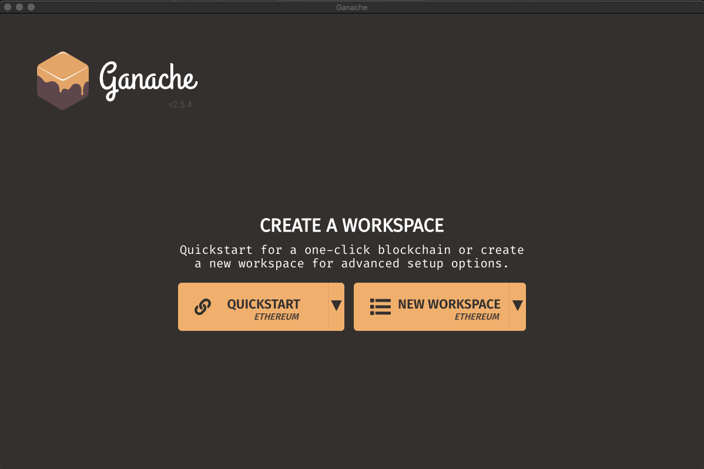

After launching the blockchain, show the ganache menu and highlight the following:

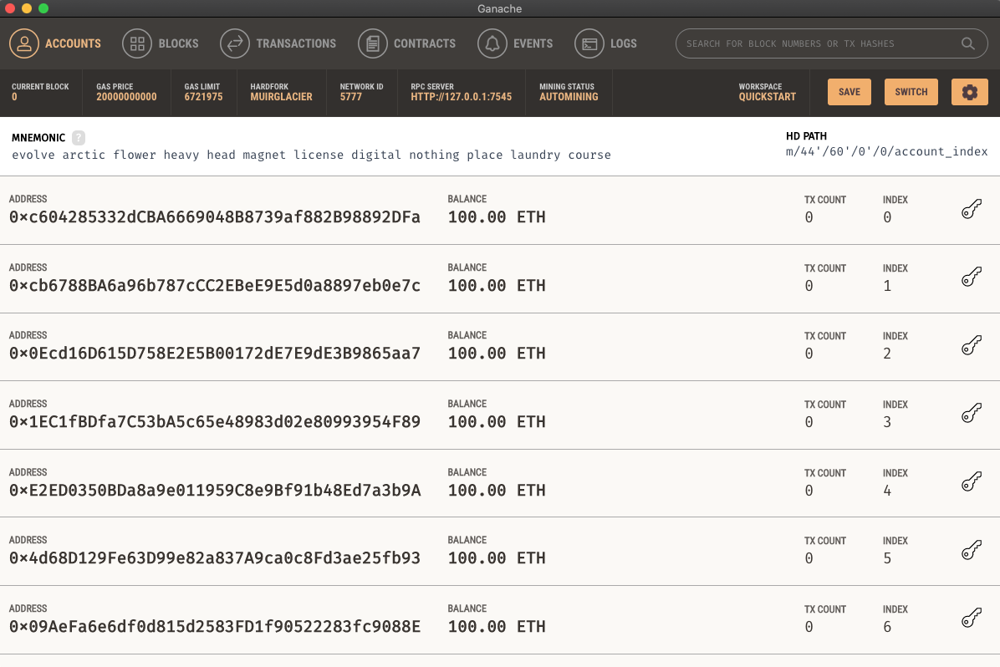

* Each account will have 100 ETH that can be used only with this local development blockchain.

* The RPC server is the local address and port that we will use with Python and web3 to connect to the blockchain.

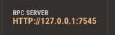

Show students how to copy the RPC server connection string to a local .env file with the following contents:

```shell
WEB3_PROVIDER_URI=http://127.0.0.1:7545
SMART_CONTRACT_ADDRESS=YOUR_DEPLOYED_CONTRACT_ADDRESS_HERE
```

* The `WEB3_PROVIDER_URI` will be used later to connect to the blockchain.

* The `SMART_CONTRACT_ADDRESS` will be updated later with the address of our deployed contract. This value can be obtained later from the Remix IDE.

Now that Ganache is setup, ask if there are any remaining questions about Ganache before moving to step 2.

#### Step 2: Import addresses into MetaMask

Open the Google Chrome browser and select the metamask extension.

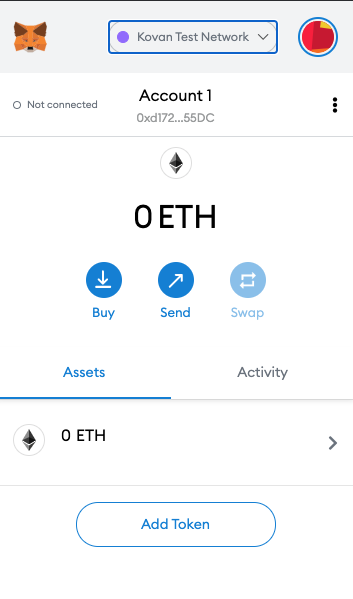

**Instructor Note:** The process of creating the CustomRPC network for Ganache should have already been completed by the students in Module 21.

  Select the network dropdown and choose `Custom RPC`.

  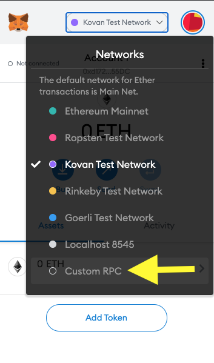

  Fill out the network form using `devNetwork` or `Ganache` for the name, `HTTP://127.0.0.1:7545` for the RPC server, and `1337` for the Chain ID. Note: The 1337 value comes from the ganache-cli documentation.

  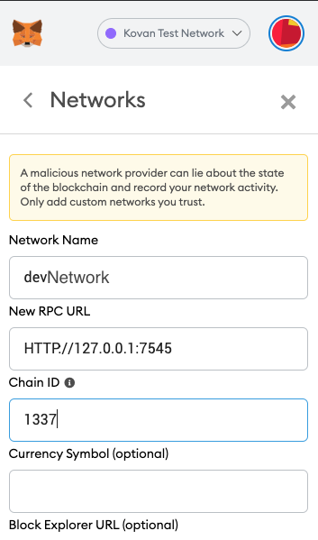

  Click the button to add this network and return to the main Metamask menu screen. You should now see `dev` selected for the network.

  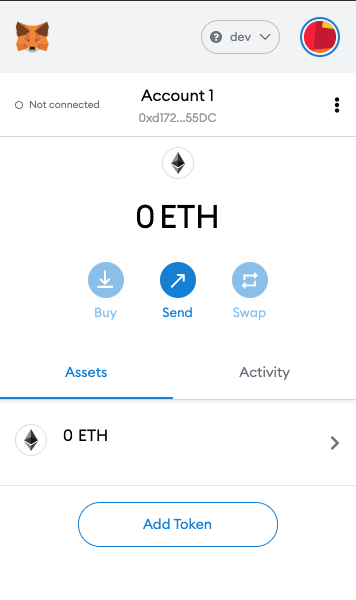

**Instructor Note:** The students should already be familiar with the concept of importing accounts from Ganache to Metamask. They may not be as familiar with the process of deleting accounts that have been previously imported and no longer available.

  Next, choose the accounts menu and click the import account button.

  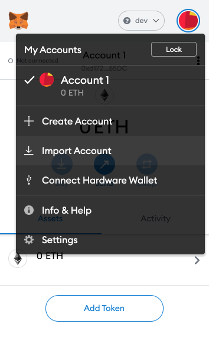

  * We will import at least 2 of the 10 accounts provided through the Ganache development blockchain. This will allow us to deploy contracts and perform transactions using the local blockchain and the pre-funded development accounts.

  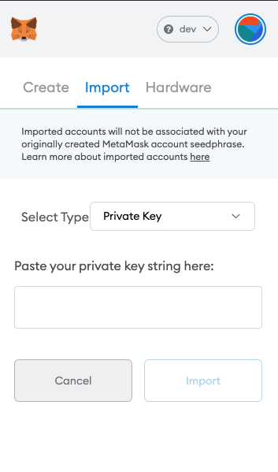

  Select the first account's private key for the form by clicking on the key icon in Ganache near the account and then copying the private key over to the metamask form.

  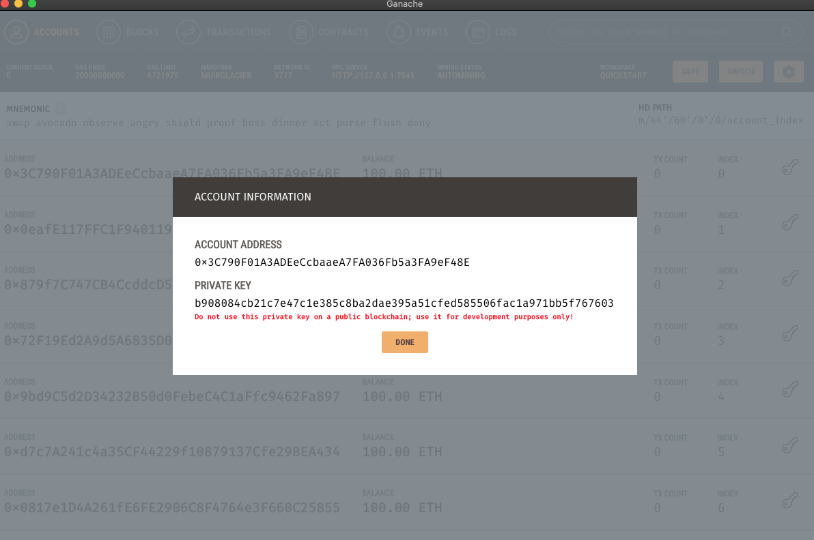

  Show students that they should see an imported account in MetaMask that has 100 ETH that can be used with the local Ganache blockchain only.

  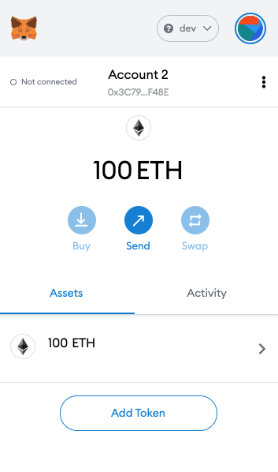

  Tell students that they can import multiple accounts if they wish, but they should import at least two accounts for development. The first account will be used to deploy the contract, and the second can be used as a student account for the certificate recipient.

Give students time to import accounts before moving on.

#### Step 3: Compile the Contract in Remix

Navigate back to the Remix IDE and show students how to compile the contract using the following points:

* The certificate contract should be selected in the list of contracts.


* In the Solidity Compiler window, the compiler version should match the pragma version. However, if the contract fails to compile later, the error message will tell you if you need to adjust the compiler version.

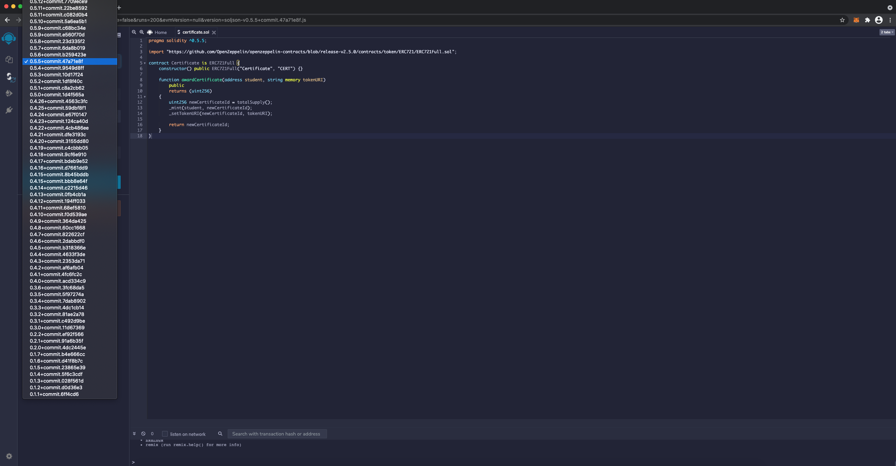

* Selecting the `certificate.sol` contract and clicking the blue button called "Compile certificate.sol" will compile the contract.

#### Step 4: Deploy the Contract in Remix

* After compiling, the `Deploy and Run Transactions` window will need configured to use `Injected Web3`.

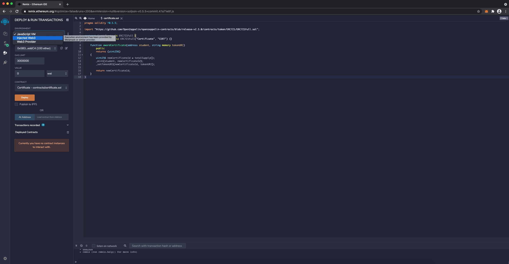

* If MetaMask is not connected to Remix yet, this may prompt you to choose which accounts should be able to connect to Remix and the contract. Any of the Ganache test accounts can be selected for this.

  * Note: If there are issues connecting to accounts, try selecting `JavaScript VM` and then select `Injected Web3` again from the menu. This sometimes triggers the prompt with Remix.

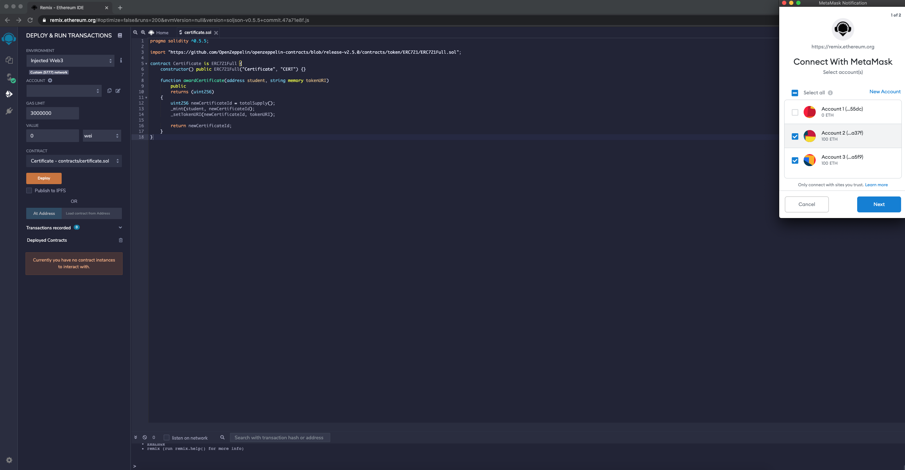

* Clicking the `Deploy` button in Remix will then deploy the smart contract to the local blockchain via MetaMask.

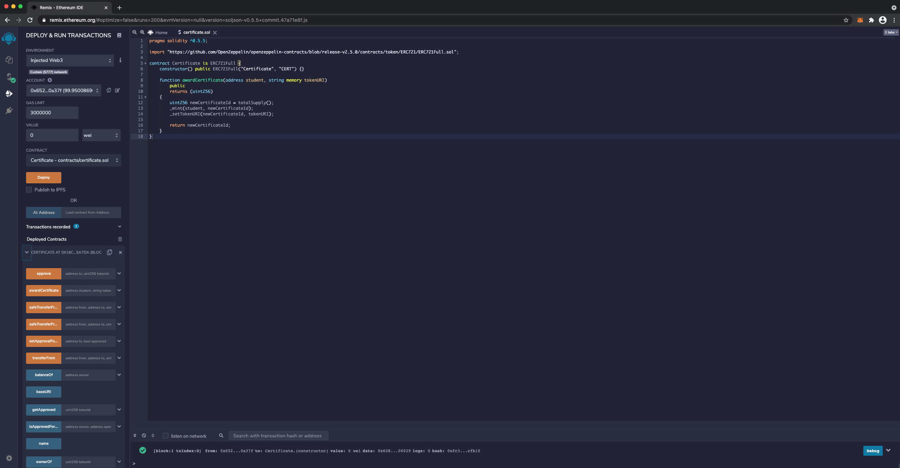

* The address of the deployed contract can then by copied and placed in the local .env file.

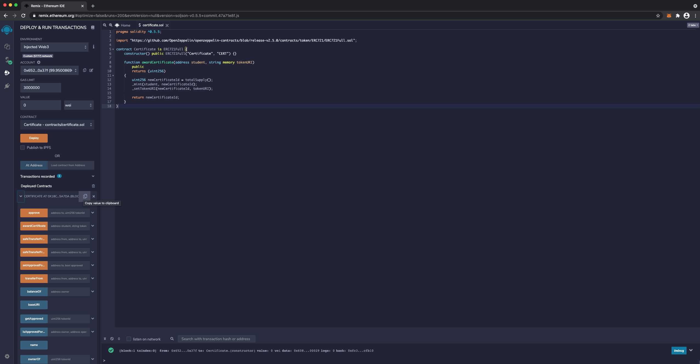

Show the .env file that should now look similar to the following:

  ```shell
  WEB3_PROVIDER_URI=http://127.0.0.1:7545
  SMART_CONTRACT_ADDRESS=0x18c00727B4fC75245383C026d02395Ad6415a7dA
  ```

#### Step 5: Interacting with the Contract in Remix

Take a few moments to show how to interact with the deployed contract using the buttons and fields in the Remix IDE.

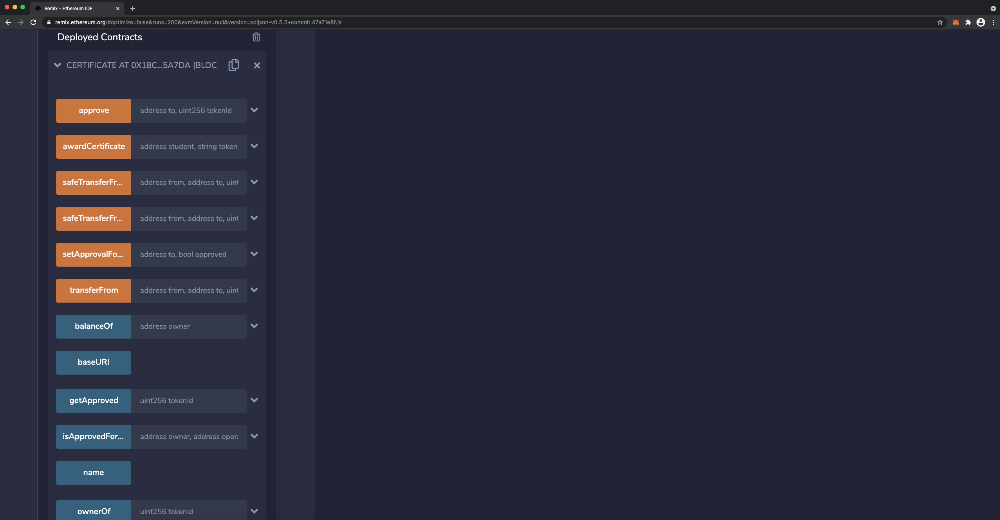

Explain the following:

* Now that the contract is deployed, we can interact with it directly via Remix using the buttons and text fields. However, what we are going to do next is build a streamlit application that uses web3 for this type of interaction. That allows us to customize the application to our needs.

Ensure that all students can deploy and interact with the smart contract before moving on to the next section.

---

### 4. Instructor Do: Building Decentralized Apps (15 min)

**Corresponding Activity** [Certificate dApp](./Activities/03-Ins_Certificate_dApp)

In this activity you will be building out the Streamlit application that allows for interaction with the awardCertificate contract from a front-end interface.

**Files:**

[Solution folder](./Activities/03-Ins_Certificate_dApp/Solved)

[Starter folder](./Activities/03-Ins_Certificate_dApp/Unsolved)

Ask students if anyone can explain what a decentralized application is and how this is different than a normal application. After a brief class discussion, introduce students to dApps using the following talking points:

* Decentralized applications are one of the big features related to Ethereum's success.

* Most applications are centralized with a central computer to run the programming and logic for the application. Centralized applications suffer from many of the same limitations and issues as centralized financial systems (i.e. single point of failure, ownership/governance issues, etc).

* Decentralized applications often behave just like regular applications, but they run their core logic on the blockchain in a decentralized manner. In fact, the web applications themselves can even be decentralized using blockchain web hosting services.

Explain to students that they have been building dApps all along with streamlit and web3. Highlight the following:

* Streamlit and web3 allow us to build web applications that allow the public to easily interact with the smart contracts on the blockchain.

* The dApps act as the bridge between users and contracts.

Explain that in order to use Streamlit and Web3.py to interact with the contract, we need to import a compiled version of the contract from remix called the `Application Binary Interface` or ABI file.

Copy the ABI file from the "Solidity complier" window of Remix and paste the file into the [`certificate_abi.json`](./Activities/03-Ins_Certificate_dApp/Unsolved/contracts/compiled/certificate_abi.json) file. Then highlight the following:

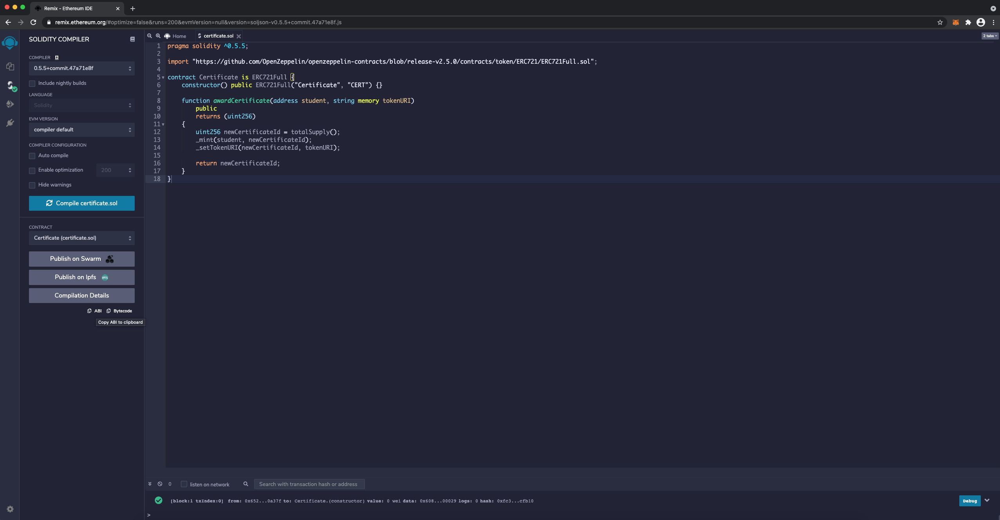

* The ABI file has information about the functions and data that web3 needs in order to connect.

* The ABI file can be stored as a JSON file.

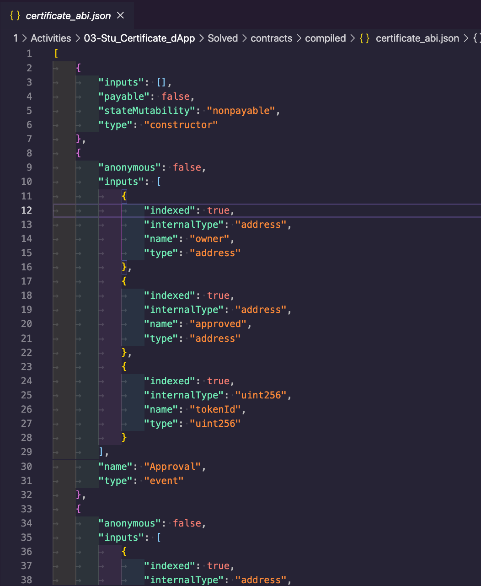

* The ABI file can be loaded into a Python program using the with-open statement and then using `json.loads` to parse the JSON file into a Python dictionary.

  ```python
  with open(Path('./contracts/compiled/certificate_abi.json')) as f:
      certificate_abi = json.load(f)
  ```

* Web3 can use the ABI dictionary and the address to connect to the smart contract.

  ```python
  # Set the contract address (this is the address of the deployed contract)
  contract_address = os.getenv("SMART_CONTRACT_ADDRESS")

  # Get the contract
  contract = w3.eth.contract(
      address=contract_address,
      abi=certificate_abi
  )
  ```

* The contract object can then be used to call functions and perform transactions on the contract just like with the Remix buttons and fields. This **example** will call the `totalSupply()` function which is part of the token and then print the total number of certificate tokens that have been created.

  ```python
  print(contract.functions.totalSupply().call())
  ```

* Highlight another example of the `contract.functions` call from the "Display Certificate" portion of the Streamlit code. This function makes a call to retrieve the address of the certificate owner.

  ```python
  certificate_owner = contract.functions.ownerOf(certificate_id).call()
  ```

* Finally, in order to use this code in streamlit, the contract needs to be cached. Otherwise, any change to any input on the application would result in the contract getting reloaded which would be inefficient.

  ```python
  ## Cache the contract on load
  @st.cache(allow_output_mutation=True)
  # Define the load_contract function
  def load_contract():

  # Contract functions here

  # Return the contract from the function
  return contract
  ```

Show the following code snippet in its entirety and explain the following:

  ```python
  # Cache the contract on load
  @st.cache(allow_output_mutation=True)
  # Define the load_contract function
  def load_contract():

      # Load Art Gallery ABI
      with open(Path('./contracts/compiled/certificate_abi.json')) as f:
          certificate_abi = json.load(f)

      # Set the contract address (this is the address of the deployed contract)
      contract_address = os.getenv("SMART_CONTRACT_ADDRESS")

      # Get the contract
      contract = w3.eth.contract(
          address=contract_address,
          abi=certificate_abi
      )
      # Return the contract from the function
      return contract


  # Load the contract
  contract = load_contract()
  ```

* The cache decorator with `allow_output_mutation=True` allows us to load the contract only once.

* The `allow_output_mutation=True` parameter tells Streamlit not to hash the contract. This is similar to Streamlit's recommendation for handling database connections which is all documented on the [streamlit advanced caching page](https://docs.streamlit.io/en/stable/caching.html#example-1-pass-a-database-connection-around).

Explain that for our purposes, we can simply reuse the code above anytime that we need to load a contract with web3 and streamlit.

Tell students that they will use what they've learned so far to build their own dApp for the certificate contract.

### 5. Student Do: Building a Certificate dApp (25 min)

In this activity, students will build a decentralized application capable of awarding certificate tokens.

Send out the following files to the students.

**Files:**

* [Instructions](./Activities/04-Stu_Certificate_dApp/README.md)

* [Starter folder](./Activities/04-Stu_Certificate_dApp/Unsolved)

#### Instructions

##### Step 1: Deploy the contract

* Deploy the [awardCertificate token](./Activities/04-Stu_Certificate_dApp/Unsolved/contracts/certificate.sol) using Remix, MetaMask, and Ganache.

* Copy the `SAMPLE.env` file to a file called `.env` and update the file with the address of your deployed contract.

##### Step 2: Load the contract

The following should be completed in the "Contract Helper function" section of the `app.py` file.

* Load the Certificate token's compiled ABI JSON file.

* Set the contract's address by loading this value from the .env file with dotenv.

* Connect to the contract using web3.py.

##### Step 3: Complete the `Award Certificate` Section

The following should be completed in the "Award Certificate" section of the `app.py` file.

* Add the streamlit component needed to enter the certificate recipient's address.

* Add the streamlit component needed to enter a link for a certificate or a string of text for the certificate.

> **Hint** You can generate a fake certificate using a free online service and link to this certificate, or you can just accept a string of text here like: "FinTech Certificate of Completion".

* Use the web3 `contract.functions` object to perform a transaction on the `awardCertificate` contract function.

##### Step 4: Complete the `Display Certificate` Section

The following should be completed in the "Display Certificate" section of the `app.py` file.

* Use the web3 `contract.functions` object and the `certificate_id` to get the `ownerOf` the certificate.

* Use the web3 `contract.functions` object and the `certificate_id` to get the certificate's `tokenURI`.

### 6. Instructor Do: Review Building a Certificate dApp (10 min)

**Corresponding Activity** [Certificate dApp](./Activities/04-Stu_Certificate_dApp)

This activity review should revolve around the code in the `app.py` file. Prior to starting the review, be sure to have Ganache accounts loaded into Metamask and Metamask linked to the `certificate.sol` contract in Remix. This contract will need to be deployed so that the address can be copied into the local .env file.

**Files:**

* [Solution folder](./Activities/04-Stu_Certificate_dApp/Solved)


Open the solution and walk students through the code. Highlight the following points:

* Once we have the contract loaded, we can use any of the functions and attributes that web3 provides for contracts. This gives us a lot of flexibility with how we design and choose the streamlit components and application.

* The following code gets a full list of the accounts available and uses that in a dropdown selection list. This could also have been created as a text input field. Building dApps is open to creativity!

```python
accounts = w3.eth.accounts
account = accounts[0]
student_account = st.selectbox("Select Account", options=accounts)
```

* Inside of the streamlit button, we can then call our awardCertificate function using web3 and supply the arguments for the function using the streamlit component values.

    * Remember that the `awardCertificate` function requires a transaction for us to mint (create) the certificate token.

    ```python
    if st.button("Award Certificate"):
        contract.functions.awardCertificate(student_account, "FinTech Certificate of Completion").transact({'from': account, 'gas': 1000000})
    ```

* Other web3 functions do not require a transaction. That's because web3 allows us to just call certain functions to access the values.

* The following code uses the Web3 `contract.functions` object in conjuction with the `ownerOf` and `tokenURI` functions to display the values in the application.

```python
certificate_id = st.number_input("Enter a Certificate Token ID to display", value=0, step=1)
if st.button("Display Certificate"):
    # Get the certificate owner
    certificate_owner = contract.functions.ownerOf(certificate_id).call()
    st.write(f"The certificate was awarded to {certificate_owner}")

    # Get the certificate's metadata
    token_uri = contract.functions.tokenURI(certificate_id).call()
    st.write(f"The certificate's tokenURI metadata is {token_uri}")
```

Use the following to discuss the tokenURI and setup a discussion around decentralized file storage.

> "Now, let's chat for a minute about that tokenURI. We were cheating by using strings of text for this, but what we really need is a secure and robust way to associate digital files with the transactions on the blockchain. That way, we aren't storing them directly in the smart contract, but we also aren't storing them in a centralized location. We want to use a peer-to-peer, decentralized file storage system that works directly with the blockchain. We can do this with a technology called the Interplanetary File Storage System (IPFS)."

Tell students that while we won't incorporate [IPFS](https://ipfs.io/) today.

They will be able to learn about [IPFS](https://ipfs.io/) and its integration with [Pinata](https://pinata.cloud/) in the async module and apply that knowledge to enhance their dApps or final projects.

Answer any remaining questions about Ganache, Metamask, Remix, Solidity and the integration with Web3 and Streamlit before moving into open office hours.

---

## Open Office Hours

### Q&A and System Support

This is an opportunity to support students in any way that they require.

* Offer personalized support for students. (**Note:** feel free to pair individual students off with instructional staff as needed.)

* Ensure that everyone's Ganache, Metamask and Remix integrations are functional, and that they can launch these in conjunction with a Streamlit application.

---

© 2021 Trilogy Education Services, a 2U, Inc. brand. All Rights Reserved.
